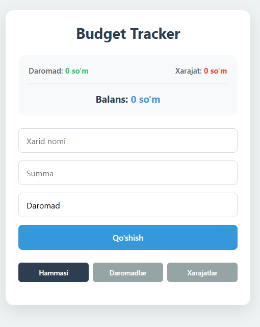

# 💰 Budget Tracker


Budget Tracker — bu sizning shaxsiy moliyaviy yordamchingiz. Daromad va xarajatlaringizni nazorat qilish endi juda oson!

---

## 🚀 Imkoniyatlar

- **⚡️ Tezkor Kiritish:** Bir soniyada tranzaksiya qo'shish.
- **📊 Vizual Tahlil:** Umumiy balansni va xarajatlar statistikasini ko'rish.
- **📱 Moslanuvchan Dizayn:** Mobil va kompyuterda birdek chiroyli ko'rinadi.
- **💾 Xotira:** Ma'lumotlar brauzerning `LocalStorage` qismida saqlanadi.

---

## 🛠 Texnologiyalar

| Texnologiya    | Vazifasi                 |
| :------------- | :----------------------- |
| **HTML5**      | Strukturani qurish       |
| **CSS3**       | Dizayn va Effektlar      |
| **JavaScript** | Hisob-kitoblar va Mantiq |

---

## 📸 Skrinshot



---

## Arxitektura

```text
budget-tracker/
├── index.html          # Asosiy HTML strukturasi
├── style.css           # Ilova dizayni va uslublari
└── js/                 # Barcha mantiqiy modullar papkasi
    ├── main.js         # Markaziy boshqaruvchi (Controller)
    ├── api.js          # Ma'lumotlar bilan ishlash mantiqi
    ├── render.js       # UI elementlarini dinamik chizish
    └── storage.js      # LocalStorage (ma'lumotlarni saqlash)
```

## ⚙️ O'rnatish

Loyihani o'z kompyuteringizga yuklab olish:

1. Repozitoriyani klon qiling: `git clone https://github.com/username/budget-tracker.git`
2. `index.html` faylini brauzerda oching.

---

## 👨‍💻 Muallif

**Sa'dullayev Behruz**
**Norbo'tayev Davlat**

- [GitHub](https://github.com/behruzsadullayev0913-arch)
- [Telegram](https://t.me/.)
